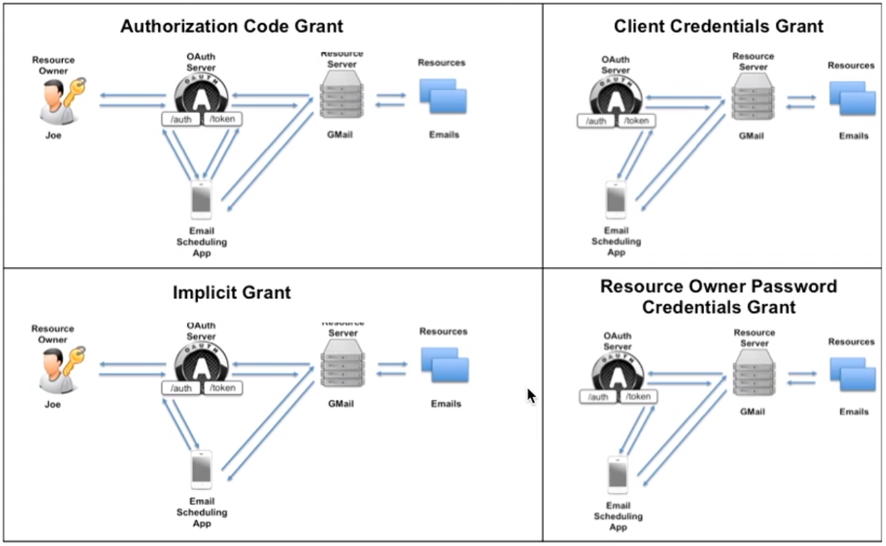
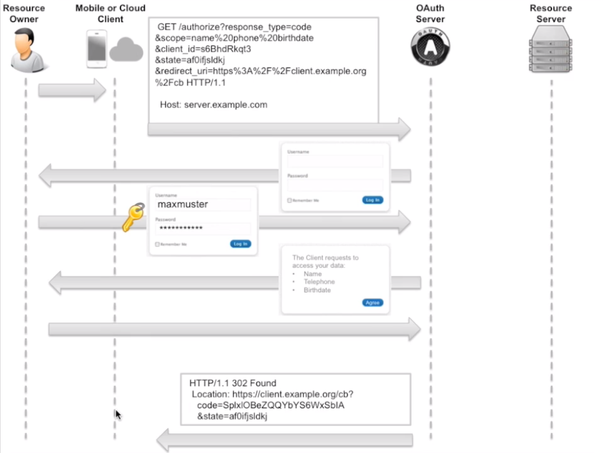
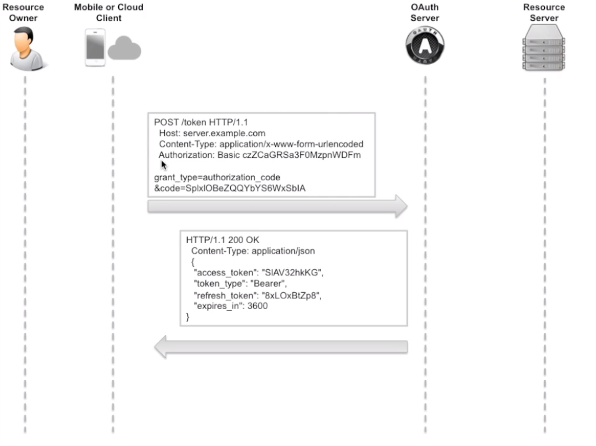
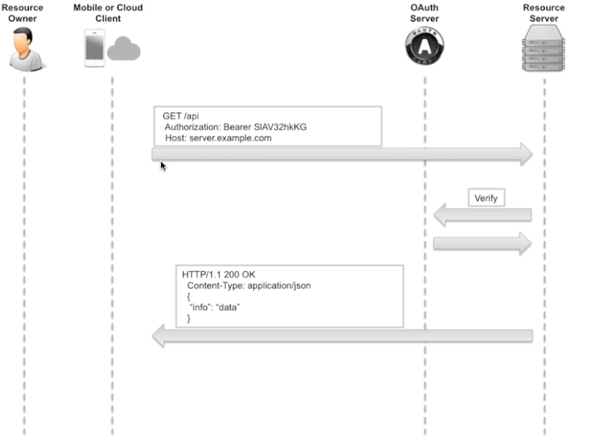
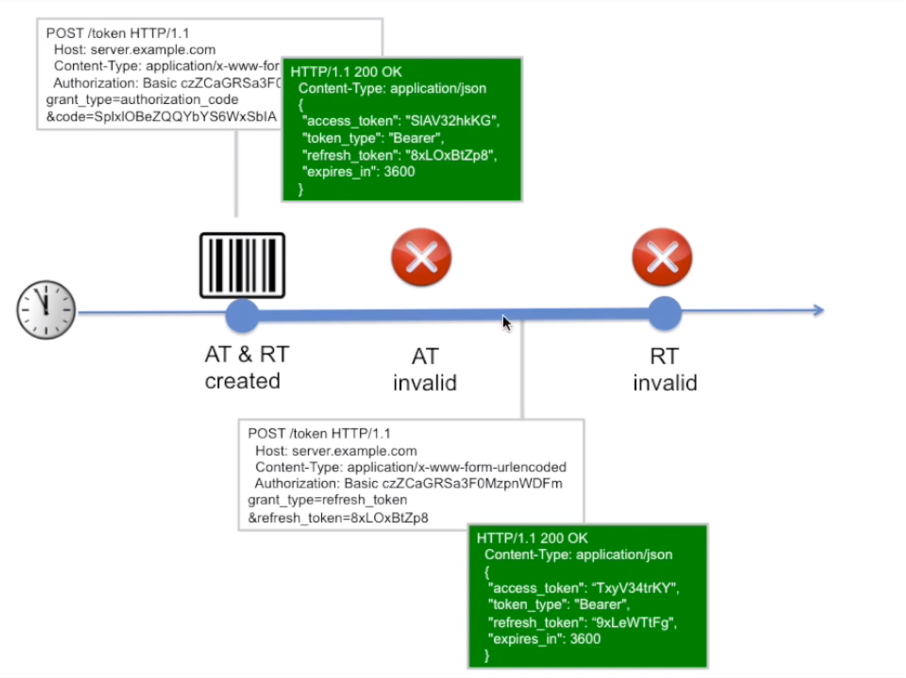
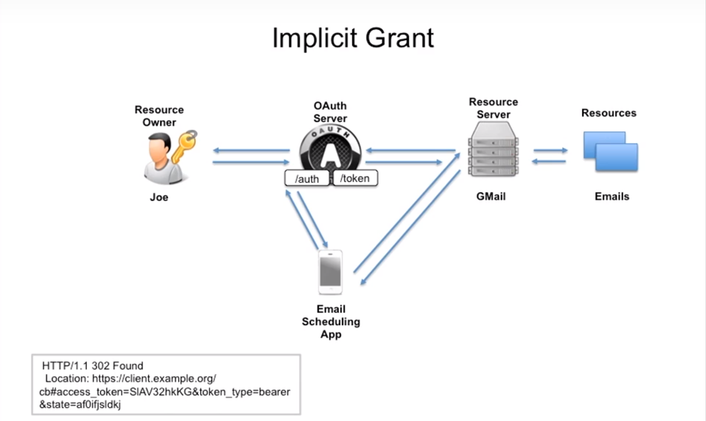
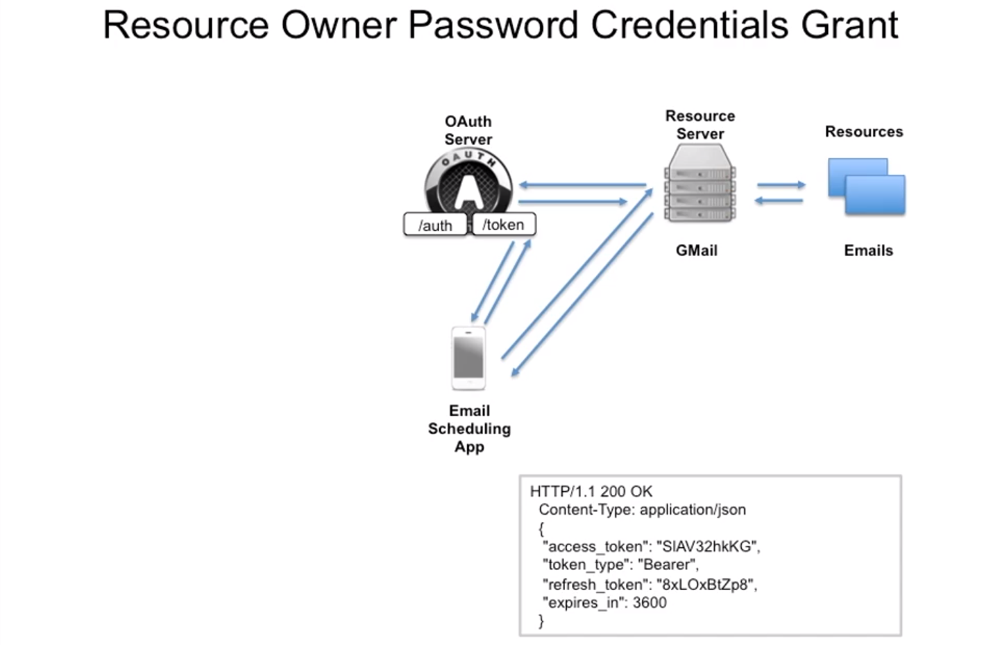

### OAuth2 Project with examples



### Code Flow Grant
<details>
<summary>Description of all steps: </summary>

Steps:


1: Get "code" from /auth endpoint scheme:

* "state" - part of application where we would like to move on.
* "scope" - part of information which we would like to take from resource server.
* "redirect_url" - http address where we will be redirected after the very last oauth response step by using HTTP 304 Redirect.

2: Get Token from /token endpoint scheme:

* "czZCaGRSa3F0MzpnWDFm" is a string consists from "clientID" + ":" + "clientSecret" and base64 encoded.
* This is the CLIENT(3rd party app) credentials. They could be validated by Oauth server.
To get clientID and Secret you need to register device first.

2: Interactions with the Resource Server:


3: Get a new Access token:

* We need to send a refresh token and get a new access token.
Pay attention on refresh token in response - refresh token was also changed as well as access token.
Next time we should send a new refresh token to get a new access token. Old refresh token - will be invalid.
* grant_type should be "refresh_token"

4: Get a new Refresh token:

* To get a new refresh token (after unauthorized response trying to take a new access token) we need to send
grant_type "refresh_token" and old token in "refresh_token" field. 

</details>

### Implicit Grant Flow

<details>
<summary>Description of all steps: </summary>
Scheme:


* Implicit flow doesn't require to use /token endpoint.
* It returns access token directly.

</details>

### Client Credentials Grant Flow (for machine-to-machine (M2M) applications, such as CLIs, daemons, or services)

<details>
<summary>Description of all steps: </summary>
Scheme:


* Credentials Grant flow doesn't require to use /auth endpoint
* Client and Owner is the same in this flow. Uses CliendID and ClientSecret to get access token
* Doesn't require a refresh token.
* Ease explanation could be found here
https://auth0.com/docs/flows/concepts/client-credentials
or here https://docs.microsoft.com/en-us/azure/active-directory/develop/v2-oauth2-client-creds-grant-flow.

</details>

### Resource Owner Password Credentials Grant

<details>
<summary>Description of all steps: </summary>

* Password anti-pattern
* FOR Trust relationship client or device / operating system / highly privileged app only
* Could be used in situations when Resource server and Official Client was produced by one organization: 
dropbox official mobile app and dropbox resource server.
* It obtains and uses username and password directly, but DOESN'T STORE IT (delete credentials immediately after getting token)

Pros and Cons: Client doesn't guarantee that it will delete username and password after obtaining tokens (access and refresh)

---

* The authorization server should take special care when enabling this grant type and only allow it when other flows are not viable.
* This grant type is suitable for clients capable of obtaining the resource owner’s credentials (username and password,
typically using an interactive form). 
* It is also used to migrate existing clients using direct authentication schemes
such as HTTP Basic or Digest authentication to OAuth by converting the stored credentials to an access token.

Scheme:

* Credentials Grant flow doesn't require to use /auth endpoint as same as Credentials Grant Flow.

</details>

### Facebook Code Grant Information
<details>
<summary>OAuth Worksheet for Facebook:</summary>

Documentation:

https://developers.facebook.com/docs/facebook-login/manually-build-a-login-flow/#login

Prerequisites:

Facebook Account
curl
---


Client Registration:
https://developers.facebook.com/

What you need:

appId = clientId =
appSecret = clientSecret =
redirectURI =
URLENCODE(redirectURI) =


your redirect URI needs to have a slash in the end!

---


Authorization Endpoint (Browser):

https://www.facebook.com/dialog/oauth?client_id=clientId&redirect_uri=URLENCODE(redirectURI)

What you need:

code =

---

Token Endpoint:

non-standard: it is a GET instead of a POST
curl -ik "https://graph.facebook.com/v2.4/oauth/access_token....URLENCODE(redirectURI)&client_id=clientId&client_secret=clientSecret&code=code"

What you need:

access_token =

---
Resource Access:

curl -H "Accept: application/json" -H "Authorization: Bearer access_token" "https://graph.facebook.com/me"

</details>

### LinkedIn Code Grant Information

<details>


<summary>OAuth Worksheet for LinkedIn: </summary>

Documentation

https://developer.linkedin.com/docs/oauth2
---
Prerequisites:

LinkedIn Account
curl

Client Registration

https://www.linkedin.com/developer/apps
---
What you need:

redirectURI =
URLENCODE(redirectURI) =
clientId =
clientSecret =

---


Authorization Endpoint (Browser)

https://www.linkedin.com/uas/oauth2/authorization?...clientId&redirect_uri=URLENCODE(redirectURI)

What you need:

code =
---


Token Endpoint:

curl -ik -X POST https://www.linkedin.com/uas/oauth2/accessToken -d grant_type=authorization_code -d code=code -d redirect_uri=URLENCODE(redirectURI) -d client_id=clientId -d client_secret=clientSecret

What you need:

access_token =
---


Resource Access:

curl https://api.linkedin.com/v1/people/~ -H "Authorization: Bearer access_token"

</details>

### Google Implicit & Code Grant Flows Information:

<details>
<summary>OAuth Worksheet for Google: </summary>

* Documentation:

https://developers.google.com/accounts/docs/OAuth2

https://developers.google.com/oauthplayground/

---
* Prerequisites:

Google Account
curl

* Registration:

https://console.developers.google.com

* What you need from registration:

redirectURI =
URLENCODE(redirectURI) =
clientId =
clientSecret =

---
* Authorization Endpoint (Browser):

https://accounts.google.com/o/oauth2/auth?redirect_uri=URLENCODE(redirectURI)&response_type=code&client_id=clientId&scope=https%3A%2F%2Fmail.google.com%2F&approval_prompt=force

* What you need:

code =

* Token Endpoint:

curl -X POST -H "content-type: application/x-www-form-urlencoded" -d "grant_type=authorization_code&code=code&redirect_uri=URLENCODE(redirectURI)&client_id=clientId&client_secret=clientSecret" "https://accounts.google.com/o/oauth2/token"

What you need:

access_token =


* Resource Access:

curl -H "Authorization: Bearer access_token" "https://www.googleapis.com/gmail/v1/users/eMailAddress/messages"

</details>

### Paypal Client Credentials Grant Flow (uses only token endpoint) Information (Sandbox example):

<details>

<summary></summary>

* Documentation:

https://developer.paypal.com/docs/integration/direct/paypal-oauth2/

https://developer.paypal.com/docs/integration/direct/make-your-first-call/

also: playground: https://devtools-paypal.com/guide/pay_paypal

---
* Prerequisites:

Paypal Account

curl

---
* Client Registration:

https://developer.paypal.com/developer/applications/create

What you need from registration:

clientId =

clientSecret =

* Token Endpoint:

paypal uses client credentials
```
curl -ik https://api.sandbox.paypal.com/v1/oauth2/token \

-H "Accept: application/json" \

-H "Accept-Language: en_US" \

-u “clientId:clientSecret" \

-d "grant_type=client_credentials"
```

* What you need:

access_token =

Resource Access:
```
curl -v https://api.sandbox.paypal.com/v1/payments/payment \

-H 'Content-Type: application/json' \

-H 'Authorization: Bearer access_token' \

-d '{
"intent":"sale",

"redirect_urls":{

"return_url":"http://example.com/your_redirect_url.html",

"cancel_url":"http://example.com/your_cancel_url.html"

},

"payer":{

"payment_method":"paypal"

},

"transactions":[

{

"amount":{

"total":"7.47",

"currency":"USD"

}

}

]

}'
```

</details>


### OAuth for Android and Ios

<details>
<summary> Q: What is the use of the redirect uri for a mobile application needing a token? The mobile is not reachable by URL? </summary>


A: The redirect URI for mobile apps typically has a custom protocol.

An example of a redirect URI for mobile apps: myapp:///events/3/

This URL is sent back in the location header to the web browser on the mobile including the HTTP status code 301 for redirect. The browser on the mobile now interprets the location header and resolves the address. MyApp needs to have a custom protocol handler installed on the device, so the browser redirects the request directly to the App on the same mobile device.

If you want to get into detail on how to install custom protocol handlers on iOS or Android, read the following:

---
Android
---

For Android, refer to Intent Filter to Launch My Activity when custom URI is clicked.

You use an intent-filter:
```
<intent-filter>

  <action android:name="android.intent.action.VIEW" /> 

  <category android:name="android.intent.category.DEFAULT" /> 

  <category android:name="android.intent.category.BROWSABLE" /> 

  <data android:scheme="myapp" /> 

</intent-filter>
```


* This is attached to the Activity that you want launched. For example:
```
<activity android:name="com.MyCompany.MyApp.MainActivity" android:label="@string/app_name">

  <intent-filter>

      <action android:name="android.intent.action.MAIN" />

      <category android:name="android.intent.category.LAUNCHER" />

  </intent-filter>
  <intent-filter>
  
      <action android:name="android.intent.action.VIEW" />

      <category android:name="android.intent.category.DEFAULT" />

      <category android:name="android.intent.category.BROWSABLE" /> 
      
      <data android:scheme="myapp" android:host="com.MyCompany.MyApp" />

  </intent-filter>
</activity>
```

* Then, in your activity, if not running, the activity will be launched with the URI passed in the Intent.

Intent intent = getIntent();

Uri openUri = intent.getData();

If already running, onNewIntent() will be called in your activity, again with the URI in the intent.

* Lastly, if you instead want to handle the custom protocol in UIWebView's hosted within your native app, you can use:

myWebView.setWebViewClient(new WebViewClient()

```
{
 public Boolean shouldOverrideUrlLoading(WebView view, String url)
 {
  // inspect the url for your protocol
 }
});
```

---

iOS

---

* For iOS, define your URL scheme via Info.plist keys similar to:
```

<key>CFBundleURLTypes</key>
    <array>
        <dict>
            <key>CFBundleURLName</key>
            <string>com.yourcompany.myapp</string>
        </dict>

        <dict>
            <key>CFBundleURLSchemes</key>
            <array>
                <string>myapp</string>
            </array>
        </dict>
    </array>
```

* Then define a handler function to get called in your app delegate:

- (BOOL)application:(UIApplication *)application openURL:(NSURL *)url sourceApplication:(NSString *)sourceApplication annotation:(id)annotation

```{
 // parse and validate the URL
}
```

* If you want to handle the custom protocol in UIWebViews hosted within your native app, you can use the UIWebViewDelegate method:

- (BOOL)webView:(UIWebView *)webView shouldStartLoadWithRequest:(NSURLRequest *)request navigationType:(UIWebViewNavigationType)navigationType

```
{
 NSURL *urlPath = [request URL];
 if (navigationType == UIWebViewNavigationTypeLinkClicked)
 {
    // inspect the [URL scheme], validate
    if ([[urlPath scheme] hasPrefix:@"myapp"]) 
    {
      ...
    }
  }
}
}
```

* For WKWebView (iOS8+), you can instead use a WKNavigationDelegate and this method:

- (void)webView:(WKWebView *)webView decidePolicyForNavigationAction:(WKNavigationAction *)navigationAction decisionHandler:(void (^)(WKNavigationActionPolicy))decisionHandler
```
{
 NSURL *urlPath = navigationAction.request.URL;  
 if (navigationAction.navigationType == WKNavigationTypeLinkActivated)
 {
   // inspect the [URL scheme], validate
   if ([[urlPath scheme] hasPrefix:@"myapp"])
   {
    // ... handle the request
    decisionHandler(WKNavigationActionPolicyCancel);
    return;
   }
 }

 //Pass back to the decision handler
 decisionHandler(WKNavigationActionPolicyAllow);
}
```

</details>

### Redirect URL on Ionic

<details>
<summary>Q: What is the OAuth 2.0 redirect URL for the Ionic app to integrate LinkedIn and Google using the REST API?</summary>

A:
* Short answer:

You define the redirect URI yourself, as a custom deeplink URL for your own app. It can have a customer scheme or it can
 be a specific URL. An example of a redirect URI for mobile apps: myapp:///events/3/

* Longer answer:

How does the redirect work?

This URL is sent back in the location header to the web browser on the mobile including the HTTP status code 301 for 
redirect. The browser on the mobile now interprets the location header and resolves the address. MyApp needs to have a
custom protocol handler installed on the device, so the browser redirects the request directly to the App on the same
mobile device.

---
* How do I define a custom deeplink URL in Ionic?

Deeplinking as a concept has evolved heavily over the last few years, with mobile devices going from supporting custom 
URL schemes (like instagram://) to now opening native apps in response to navigation to URLs (like amazon.com).
 Additionally, OS’s now support powerful ways to index and search data inside of native apps.

To help Ionic developers deeplink more easily, we are excited to announce a new, official way to deeplink into both
Ionic 1 and Ionic 2 apps (and non-ionic Cordova apps): the Ionic Deeplinks Plugin along with Ionic Native1.3.0.
Let’s take a look at how it works:


---
* Choosing a Deeplink

The first thing we need to do is figure out what kind of deeplink we want our app to respond to. Let’s say we run a Hat
Shop and we have a website version of our store where we display our many fancy Hats. A URL to one of those Hats might
look like https://myapp.com/events.

We can actually launch our app when someone navigates to this URL on Android or iOS and display the app version of
the Hat product page. Additionally, let’s say we want to enable a custom URL scheme of the form myapp://events.

Now that we have our URL scheme, website, and deeplinking path decided, let’s install the Deeplinks Plugin.


---
* Installing Ionic Deeplinks

The Ionic Deeplinks plugin requires some variables in order to get set up properly:

cordova plugin add ionic-plugin-deeplinks --variable URL_SCHEME=myapp --variable DEEPLINK_SCHEME=https --variable DEEPLINK_HOST=myapp.com

In the install command, we provide the custom URL scheme we want to handle (myapp), the host domain we will respond to
(myapp.com) and the host protocol we will listen for, which 99% of the time will be httpsas it’s required on iOS and Android.

We’re almost ready to handle deeplinks, we just need to configure Universal Links on iOS and App Links on Android 6.0
so our app can open when navigating to ionic-hats.com.


---
* Configuring Universal Links (iOS) and App Links (Android)

To configure iOS and Android, we need to enable Universal Links for iOS, and App Links for Android (6.0+). This process
 is primarily done on the server side of your website. You’ll publish a specific json file for iOS and one for Android,
  ensure your site is using HTTPS, and then configure your app to open in response to links to that domain.


---
* For Android, it pretty much just works from the plugin install above.

However, for iOS, you’ll then enable the domain in the Associated Domains section of your entitlements, with the form
applinks:yourdomain.com.

</details>