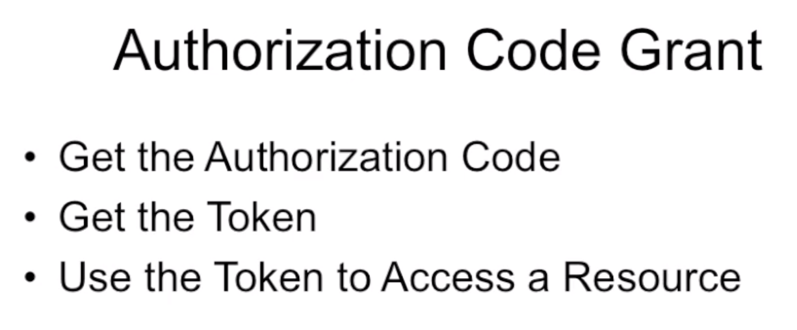
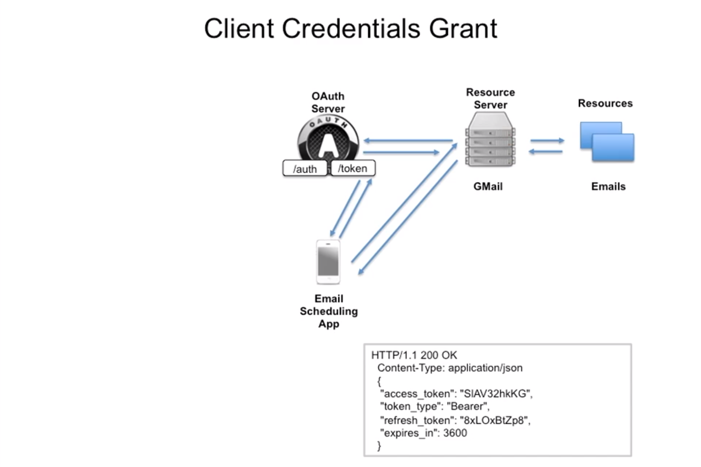

### OAuth2 Project with examples

### Code Flow Grant

Description of all steps: 

Steps:

1: Get "code" from /auth endpoint scheme:

* "state" - part of application where we would like to move on.
* "scope" - part of information which we would like to take from resource server.
* "redirect_url" - http address where we will be redirected after the very last oauth response step by using HTTP 304 Redirect.

2: Get Token from /token endpoint scheme:

* "czZCaGRSa3F0MzpnWDFm" is a string consists from "clientID" + ":" + "clientSecret" and base64 encoded.
* This is the CLIENT(3rd party app) credentials. They could be validated by Oauth server.
To get clientID and Secret you need to register device first.

2: Interactions with the Resource Server:

3: Get a new Access token:

* We need to send a refresh token and get a new access token.
Pay attention on refresh token in response - refresh token was also changed as well as access token.
Next time we should send a new refresh token to get a new access token. Old refresh token - will be invalid.
* grant_type should be "refresh_token"

4: Get a new Refresh token:

* To get a new refresh token (after unauthorized response trying to take a new access token) we need to send
grant_type "refresh_token" and old token in "refresh_token" field. 

### Implicit Grant Flow

Description of all steps: 

Scheme:

* Implicit flow doesn't require to use /token endpoint.
* It returns access token directly.

### Client Credentials Grant Flow (for machine-to-machine (M2M) applications, such as CLIs, daemons, or services)

Description of all steps: 

Scheme:

* Credentials Grant flow doesn't require to use /auth endpoint
* Client and Owner is the same in this flow. Uses CliendID and ClientSecret to get access token
* Doesn't require a refresh token.
* Ease explanation could be found here
https://auth0.com/docs/flows/concepts/client-credentials
or here https://docs.microsoft.com/en-us/azure/active-directory/develop/v2-oauth2-client-creds-grant-flow.

### Resource Owner Password Credentials Grant
* Password anti-pattern
* FOR Trust relationship client or device / operating system / highly privileged app only
* Could be used in situations when Resource server and Official Client was produced by one organization: 
dropbox official mobile app and dropbox resource server.
* It obtains and uses username and password directly, but DOESN'T STORE IT (delete credentials immediately after getting token)

Pros and Cons: Client doesn't guarantee that it will delete username and password after obtaining tokens (access and refresh)

Description of all steps: 

* The authorization server should take special care when enabling this grant type and only allow it when other flows are not viable.
* This grant type is suitable for clients capable of obtaining the resource owner’s credentials (username and password,
typically using an interactive form). 
* It is also used to migrate existing clients using direct authentication schemes
such as HTTP Basic or Digest authentication to OAuth by converting the stored credentials to an access token.

Scheme:

* Credentials Grant flow doesn't require to use /auth endpoint as same as Credentials Grant Flow.

### Facebook code grant information

OAuth Worksheet for Facebook:

Documentation:

https://developers.facebook.com/docs/facebook-login/manually-build-a-login-flow/#login

Prerequisites:

Facebook Account
curl
---

Client Registration:
https://developers.facebook.com/

What you need:

appId = clientId =
appSecret = clientSecret =
redirectURI =
URLENCODE(redirectURI) =

your redirect URI needs to have a slash in the end!

---

Authorization Endpoint (Browser):

https://www.facebook.com/dialog/oauth?client_id=clientId&redirect_uri=URLENCODE(redirectURI)

What you need:

code =

---

Token Endpoint:

non-standard: it is a GET instead of a POST
curl -ik "https://graph.facebook.com/v2.4/oauth/access_token....URLENCODE(redirectURI)&client_id=clientId&client_secret=clientSecret&code=code"

What you need:

access_token =

---
Resource Access:

curl -H "Accept: application/json" -H "Authorization: Bearer access_token" "https://graph.facebook.com/me"

